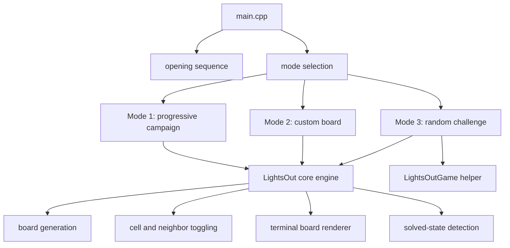

<div align="center">

# Lights Out

Terminal-based strategic puzzle game written in modern C++.

[](https://isocpp.org/)
[](Makefile)
[](#terminal-interface)
[](#gameplay-model)

[Demo Video](https://youtu.be/7oOvwAudPyg?feature=shared) · [Build Instructions](#build-and-run) · [Gameplay Modes](#game-modes)

</div>

---

## Overview

**Lights Out** is a command-line implementation of the classic grid-toggle puzzle. The player is given a board of illuminated and non-illuminated cells. Selecting one cell flips that cell and its four orthogonal neighbors. The objective is to drive the entire board into the solved state with every light turned off.

This version expands the original puzzle into a multi-mode terminal game with progressive levels, custom board dimensions, randomized challenge generation, move tracking, terminal color rendering, and a story-driven opening sequence.

## Gameplay Model

Each board state is represented as a two-dimensional grid:

- `X` means the light is on.
- `O` means the light is off.
- Selecting a coordinate toggles the selected cell.
- The same action also toggles the upper, lower, left, and right neighbors when they exist.
- A puzzle is solved when no `X` cells remain.

```text
Before selecting center        After selecting center

O X O                          O O O
X X X        toggle (2,2)      O O O
O X O                          O O O
```

## Game Modes

| Mode | Name | Board Strategy | Challenge Profile |
| --- | --- | --- | --- |
| `1` | Progressive Campaign | Starts from `3 x 3` and grows up to `20 x 20` | Long-form difficulty curve with level progression |
| `2` | Custom Board | Player chooses a size from `3` to `20` | Controlled practice and experimentation |
| `3` | Random Challenge | Board size is generated randomly | Limited-move puzzle with higher uncertainty |

## Feature Matrix

| Capability | Implementation |
| --- | --- |
| Randomized board initialization | Uses pseudo-random coordinate toggles to generate solvable-looking puzzle states |
| Dynamic board dimensions | Supports square boards from `3 x 3` to `20 x 20` |
| Terminal visualization | Renders row/column indices with ANSI-colored `X` and `O` symbols |
| Input validation | Rejects invalid game modes and out-of-range board sizes |
| Move accounting | Counts player actions during the solving loop |
| Progressive mode | Reuses the core engine across increasing board sizes |
| Limited-move mode | Applies a move cap for randomized challenges |
| Story prologue | Reads `story.txt` through file I/O before gameplay starts |
| Modular codebase | Separates core rules, Mode 1 flow, Mode 3 logic, and application entry point |

## Architecture



### Core Components

| File | Responsibility |
| --- | --- |
| `main.cpp` | Program entry point, story loading, mode selection, and top-level game flow |
| `core.h` | Main `LightsOut` engine: board state, rendering, toggling, validation loop, and win detection |
| `mode1.h` | Progressive campaign controller from `3 x 3` through `20 x 20` |
| `mode3.h` | Random challenge interface and helper declarations |
| `mode3.cpp` | Random board size generation and breadth-first search helper implementation |
| `story.txt` | Narrative opening content loaded at runtime |
| `Makefile` | Reproducible local build commands |

## Technical Notes

- The board is stored as `vector<vector<bool>>`, giving the game a compact, dynamically sized state model.
- Neighbor propagation is centralized in `change_cell`, so every mode shares the same rule implementation.
- The display layer adapts spacing for single-digit and double-digit board indices.
- Mode 3 includes a `LightsOutGame::calculateSteps` breadth-first search helper for state-space exploration.
- The game uses `<unistd.h>` for the timed story opening through `sleep()`, which is available on Linux and macOS.

## Terminal Interface

During gameplay, enter a row and column to toggle a cell:

```text
Enter the row and column of the X/O to change it: 2 3
```

To leave a running game, enter `q` for either coordinate:

```text
q q
```

## Build And Run

### Requirements

- `g++` with C++11 support
- `make`
- Linux or macOS terminal recommended for ANSI colors and `<unistd.h>`

### Compile

```bash
make
```

### Play

```bash
./program
```

### Clean Build Artifacts

```bash
make clean
```

## Repository Layout

```text
.
├── Makefile
├── README.md
├── core.h
├── main.cpp
├── mode1.h
├── mode3.cpp
├── mode3.h
└── story.txt
```

## Project Scope

The project demonstrates a complete terminal game loop with randomized state generation, modular C++ organization, dynamic data structures, file input, ANSI rendering, and multiple gameplay modes built on a shared puzzle engine.
